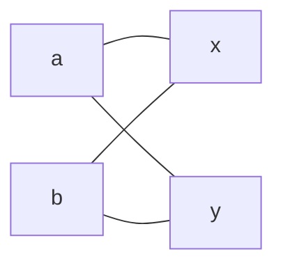

$\gdef\coker{\operatorname{coker}} \gdef\im{\operatorname{im}}
\gdef\coim{\operatorname{coim}}$

Functions are the most fundamental atom in the semantics of mathematics, the
tool we use to express all other ideas. At least, this is how we are all taught
to view mathematics. But I think things don't have to, and probably shouldn't,
be this way. Functions allow us to write down well defined expressions, but
there are many situations where functions are innelegant and we have to go to
great lengths to get around their deficiencies. I think a more general notion of
correspondence is needed. In this essay I will show some of the problems with
functions, and then start to develop the ideas of an alternative theory. Note
that I will assume an undergraduate level of familiarity with math in this
essay.

A function can be thought of as a relation between two sets, called the domain
and the range, where _each thing in the domain is related to exactly one thing
in the range._ This allows us to write down unambiguous single valued
expressions, but as we will see this condition is often unnatural. The most
familiar examples of single valued functions being a burden are probably the
square root (particularly the complex case) and the complex logarithm. Often
when people talk about these functions they will start by specifying exactly
which branch they are talking about, when really what they're saying applies
equally well to all branches and this pedantry adds nothing to the conversation.
Then in order to make sense of multivalued functions they will do grotesque
things like define a sheaf.

My favorite example of the deficiency of functions is angles. We are taught that
angles are real numbers which can naturally be added and subtracted, subject to
an equivalence modulo some period. There are also hyperbolic angles which are
less familiar, but are also conventionally thought of as real numbers that can
be added and subtracted. However, if you dive deep enough into hyperbolic
geometry, you will find that the space of hyperbolic angles naturally has a
second sheet, that it should really be thought of as two copies of $\mathbb R$.
That is, it's naturally shaped like a hyperbola. And the space of elliptic
angles (ie angles) is naturally shaped like a circle because of that
periodicity.

For these reasons I think that the spaces of elliptic and hyperbolic angles
should instead be defined to be the groups $SO(2)$ and $SO(1,1)$ respectively.
But then how do we conceptualize those real numbers that we usually use for
angles? One could say that the word "angle" _means_ those numbers, although for
our purposes I'll take "angles" to be these underlying groups. The tool we are
given to describe this type of correspondence is a homomorphism, which in this
case will be between $\mathbb R$ and $SO( * )$ where $ * =2$ or $1,1$.

_But which way does the homomorphism go?_ First let's try $\mathbb R \to SO( *
)$. This is surjective but not injective in the elliptic case, and injective but
not surjective in the hyperbolic case. The problem is this fails to describe the
second leaf of the hyperbolic angles. If we go the other way $SO( * ) \to
\mathbb R$, then we're surjective not injective in the hyperbolic case, and it
just doesn't work in the elliptic case.

So what should we do? Do we say that elliptic angles have a homomorphism
$\mathbb R \to SO(2)$ and hyperbolic angles go the other way $SO(1,1) \to
\mathbb R$? I think it's time to introduce a more general notion of
homomorphism, built on top of a more general notion of function.

## Correspondences

We'll call them correspondences. A correspondence is a relation such that if
$a\sim x$, $b \sim x$, and $b \sim y$, then $a \sim y$. In other words, in the
diagram

if three of the edges hold, then the fourth holds as well. Here these edges
represent two elements being related.

The domain and range will be indicated like $f: A \leftrightarrow B$. Define the
image and coimage by $\im f := f(A)$, $\coim f := f^-(B)$.

Note that correspondences are not exactly "multivalued functions", as the images
of two things in the domain cannot overlap, they must be the same or disjoint.
Correspondences are geared towards "equivalence-like" relations. A "multivalued
function" would just be any relation.

### Lemma

_A relation $\sim$ is a correspondence between two sets $A$ and $X$ iff it
induces an equivalence relation on both the image and coimage, with a natural
bijection between the equivalence classes._

### Proof

lol no

We will use the familiar notation from functions, but the meaning will now be
somewhat different. If $f$ is our correspondence, then $f(a)$ can be thought of
as the set of things corresponding to $a$, called the image of $a$. Or
sometimes, a statement involving $f(a)$ may implicitly mean "for any $x \in
f(a)$." I'm still working out the details for this part.

Now we can introduce our generalization of homomorphisms. A homospondence is a
correspondence $f$ between groups satisfying $f(ab) = f(a)f(b)$ and $1 \in
f(1)$. To be less ambiguous, if two of the statements $a \sim x$, $b \sim y$,
and $ab \sim xy$ hold, then the third does as well, and $1 \sim 1$. Or, if we
interpret $f(a)$ to mean the image of $a$, then $f(a)f(b)$ can be interpreted as
a multiplication of sets, $AB := \\{ab : a \in A, b \in B\\}$.

As an aside, I hear people say thing like "The cute way to show $aNa^- = N$ iff
$aN = Na$ is to multiply on the right by $a^-$, but you can't actually do that,
and the actual proof is more rigorous." But you actually can! Subset
multiplication is associative, and if you treat elements as singletons then
there's only one operation being used in expressions like $abAB$.

Now we can generalize the theory of homomorphisms. Define $\ker f := f^-(1)$,
$\coker f := f(1)$, or equivalently $\ker f$ is all the things equivalent to $1$
in the induced equivalence relation. Note that a homospondence is a homomorphism
iff it's a function iff the cokernel and coimage are trivial.

### Lemma

_A homospondence is always $m$ to $n$, $\exists m, n$. In other words, $\\#f(a)
= n \ \forall a \in \coim f$, $\\#f^-(x) = m \ \forall x \in \im f$, where $m,
n$ depend only on $f$ and may be infinite._

What we really should be saying actually is that every preimage is a coset of
the kernel and every image is a coset of the cokernel. This is a more powerful
statement and is how we would prove the lemma.

### Lemma

_$\ker f$ is a normal subgroup of $\coim f$_

Note that $\ker f$ is not generally a normal subgroup of $G$. Take for example
the homospondence $f: S_3 \leftrightarrow \\{1\\}$ where $f^-(1) = S_2$. Also
note that as an immediate corollary $\coker f \lhd \im f$.

### Proof

Take $a \in \coim f$, so $f(a) = x$. $a(\ker f)a^- = f^-(x)f^-(1)f^-(x^-) =
f^-(x1x^-) = f^-(1) = \ker f$.

### Theorem (First Isospondence Theorem)

$$\frac{\coim f}{\ker f} = \frac{\im f}{\coker f}$$

We get the first isomorphism theorem as a special case when the coimage is the
whole group and $\coker f = 1$, ie when $f$ is a homomorphism.

This theorem can be thought of as giving a sort of greatest common divisor of
groups. That is, given a homospondence $f:A \leftrightarrow B$, there is a group
$D$ with homomorphisms from $A$ and $B$ which commute with $f$, and such that
whenever we have homomorphisms from $A$ and $B$ to some third group they factor
through $D$.

I conjecture that there is also a sort of lowest common multiple of groups. That
is, a group $M$ with homomorphisms to $A$ and $B$ which commute with $f$ and
such that whenever a third group has homomorphisms to $A$ and $B$ they factor
through $M$.

## Exercise

Apply these ideas to the example of angles. The correspondence should be
$\infty$ to $1$ in the elliptic case and $1$ to $2$ in the hyperbolic case, or
vice versa. In each case either $f$ or $f^-$ is a function, but now we can have
the correspondences pointing the same way.
