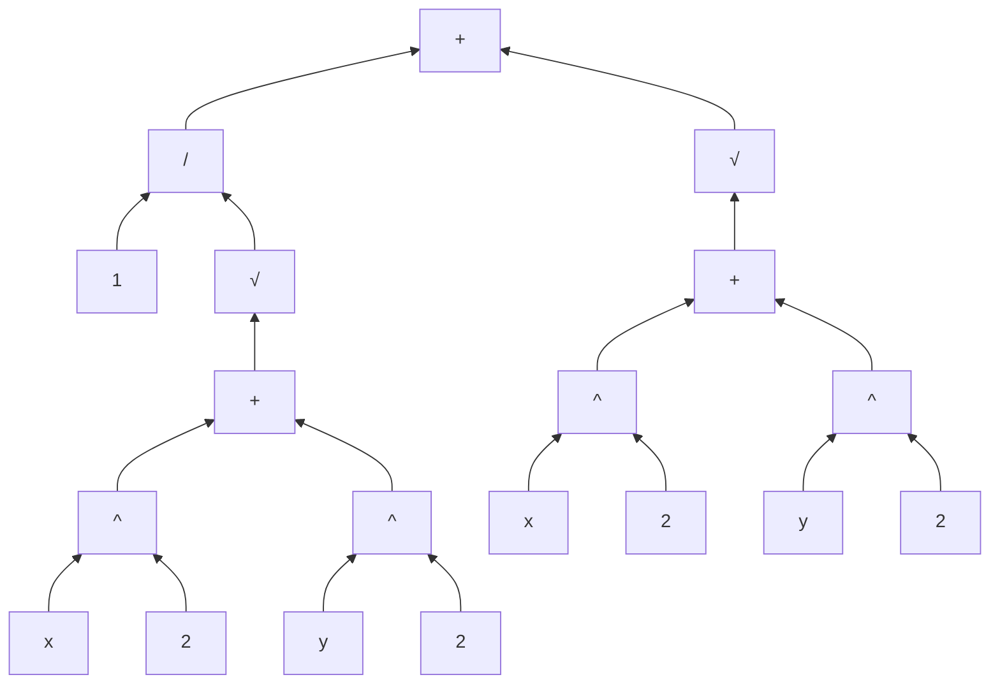
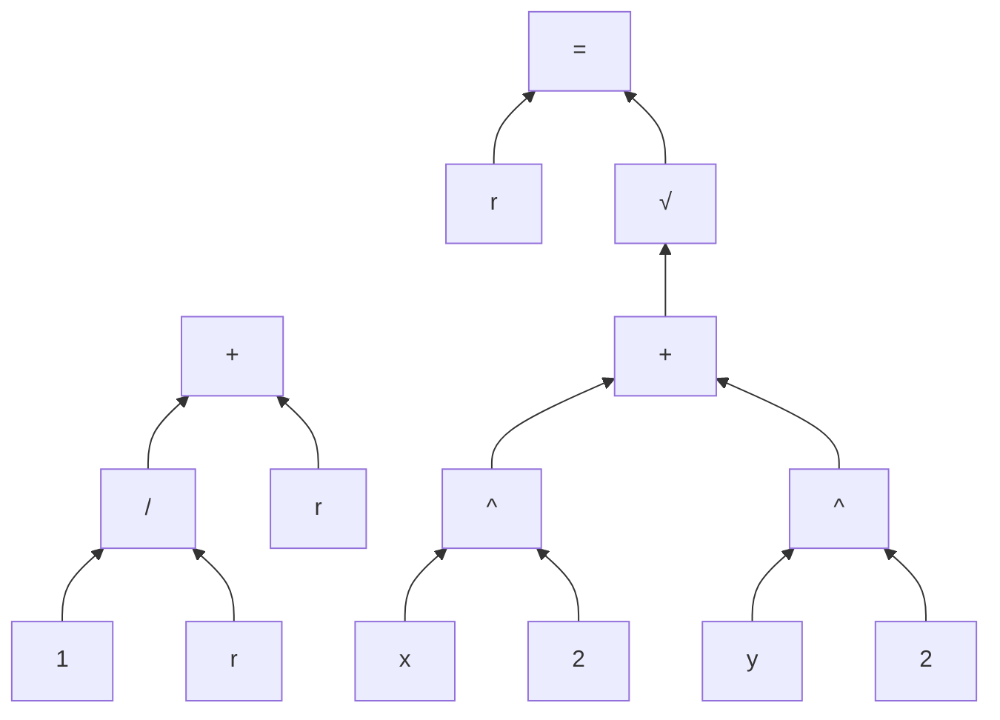
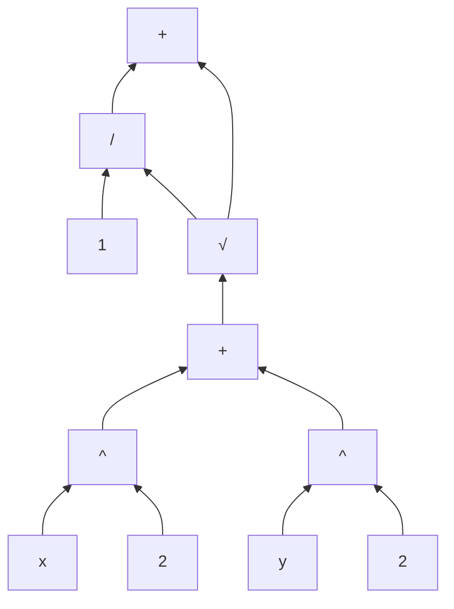
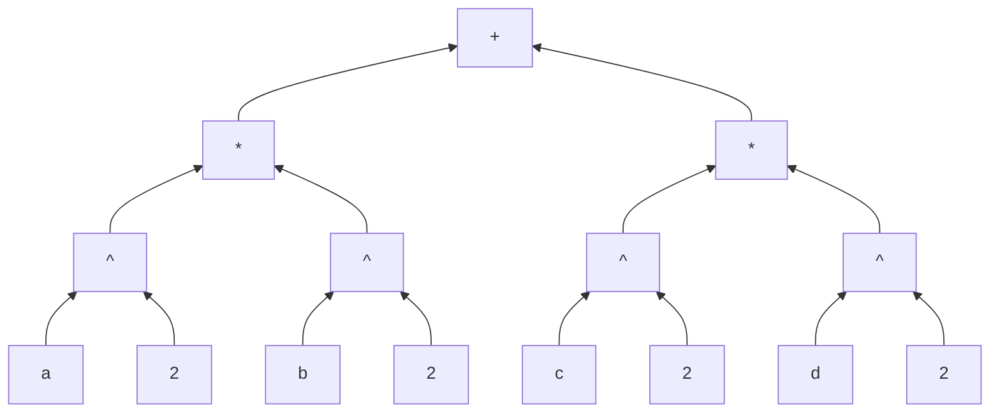
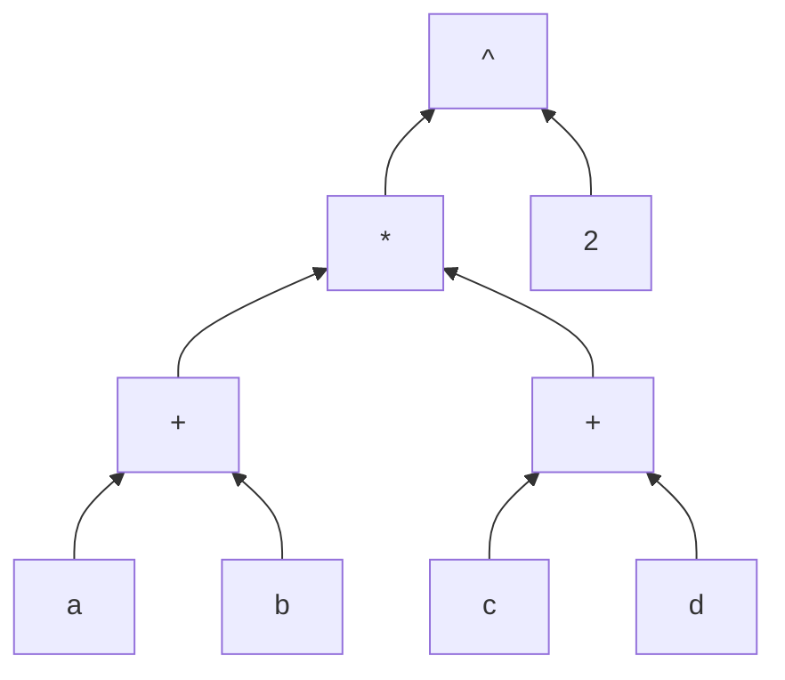

I hate parenthesis. I think they're a huge curse for the readability and
writability of both code and math. Consider this code snippet:

```rust
sqrt(pow2(scale.x * (this.x - that.x)) + pow2(scale.y * (this.y - that.y)))
```

This is incredibly difficult to parse for a reader of this code, especially when
the parenthesis stack up like at the end. This example is fairly tame with the
parenthesis only going three layers deep, but it can get worse in the wild.
Further, say you had originally written this:

```rust
sqrt(pow2(this.x - that.x) + pow2(this.y - that.y))
```

and you later decided you wanted to add the scale factors. Lets show all the
places where you'd have to edit your code:

```
sqrt(pow2(this.x - that.x) + pow2(this.y - that.y))
```

Notice how you have to edit your code in four places, even though you're only
making meaningful changes in two. This is how parenthesis damage writability:
they make you do a lot of extra cursor jumping. And say you want to later remove
those scale factors, you have to go back to all four locations again. Especially
for people who use their mouse to move their cursor, that extra clicking can add
a lot of friction.

The next biggest curse in my eyes is assigning values to named variables,
although there are places where I think this is the right choice. Say I want to
write the expression

$$ \frac 1 {\sqrt{x^2 + y^2}} + \sqrt{x^2 + y^2} $$

I start writing this in code and I get to here:

```rust
1 / sqrt(x^2 + y^2) +
```

At this point I realize that I'm about to repeat myself. So I grab my mouse,
select `sqrt(x^2 + y^2)`, ctrl-x, click on the end of the line above, press
enter, write `let r =`, ctrl-v, `;`, click back to where I cut the expression
from, `r`, click on the end of the line, and finally write `r;`[^1]. In most
popular programming languages, this is what you have to do in order to use the
same expression twice without repeating yourself.

[^1]: These days I would do this a bit faster with keyboard shortcuts, but this
is how I would have done this when I was younger. I'd imagine this is a very
common way to do this.

Now, in this case the name `r` was a pretty obvious choice for me. The
expression that I pulled out represents something meaningful, the distance
between the points $(0, 0)$ and $(x, y)$, and is commonly given the name $r$. In
fact, in whatever hypothetical program I would have been writting where this
expression came up, the odds are high that I would need to use the value `r`
many times more, and so this step of hoisting my expression out into a variable
was worth it. However, there are other situations where the expression I want to
use twice is not meaningful. Take for example:

```
if data.any(is_nan) || data.any(is_zero) {

  if data.any(is_nan) {
  	log("uh oh!");
  }
  
  return Error;
}
```

<!-- damn bro this paragraph sucks ass -->

Afaict, there is no way to write this control flow without either repeating
`data.any(is_nan)` twice or assigning it to a variable, at least with the kind
of if statements that we have in Python and Rust and Go and every other
programming language descended from C. This situation came up for me in a
project I was working on, except the expression I needed to use twice was even
bigger, and I ended up assigning it to a variable. But the cost of hoisting an
expression into a variable is more than just cursor jumping. You also have to
think of a name for that variable. Again, if the variable is meaningful this
isn't so hard and is probably a good investment, but in most cases the
expression is not something we want to necessarily assign meaning to. If we name
it `theres_a_nan`, then maybe we're not making it clear why that matters. So
maybe we call it `something_went_wrong`, but then we still have to worry if
that's specific enough, or if it's a good representation of what it represents.

Then when someone else reads your code they also have to take the time to learn
what your variable means, again damaging the readability of your code.

## The problem that the problem solves

These two curses, parenthesis and named variables, solve two problems that arise
when trying to design a language with arbitrary expressions. Let's take a step
back and think about what an expression is. Consider our previous example

$$ \frac 1 {\sqrt{x^2 + y^2}} + \sqrt{x^2 + y^2} $$

This expression is the sum of two other expressions. The first of those two
expressions is the ratio of two _other_ expressions. The denominator of that
ratio is the square root of yet _another_ expression. We can go on recursively
breaking our expression down into smaller expressions, and we end up with a tree
structure that looks like this:



Now as you'll probably notice, there's a huge chunk of this tree that is
duplicated, corresponding to the fact that we wrote the same subexpression
twice. As mentioned before, the solution allowed by the rules of modern math
language is to use a variable:

$$\frac 1r + r \quad\text{where}\quad r = \sqrt{x^2 + y^2}$$

This corresponds to the structure



However, looking at the tree, we can imagine an even more straightforward
solution:



This is no longer a tree, but rather a more general directed graph.
Unfortunately, the grammar of modern mathematics only allows us to write
expressions which have a tree structure, as in the first two examples. If you
try to come up with some expression with the structure of the third example,
using standard mathematical language, you will find that it is impossible.

In human languages, another tool we have to solve this problem is pronouns. You
can use words like "he" in your sentence and your listener can figure out from
context which previously mentioned thing you are referring to. Often times there
are multiple things which you could be referring to with "he", but most of the
time it's clear to a sentient listener which one makes the most sense. We could
try using pronouns to write our expression:

$$\frac 1 {\sqrt{x^2 + y^2}} + \text{him}$$

but it is not clear whether $\text{him}$ refers to $x^2$, $x^2 + y^2$, or what.

<!-- TODO: dedup these two paragraphs ^ v -->

The second problem is how to make the tree structure of your expression clear in
writing. Human languages like English also have this tree structure, but there
we have the advantage that our listener is capable of resolving ambiguities.
Often when listening to an English sentence you will have to try out a few
different tree structures until you find the one that makes sense. Some
sentences even have multiple structures that make sense and this can be a source
of jokes. However, with code our audience is computers which have only recently
become capable of resolving such ambiguities, and in both math and code we want
our meaning to be completely explicit. So we need to make the tree structure
completely clear in writing. Our two main tools for this are order of operations
and parenthesis.

Consider an expression with the following structure:



In algebra this can be written succinctly:

$$a^2 b^2 + c^2 d^2$$

However, now consider this similar looking structure:



Here we are not as fortunate:

$$((a + b)(c + d))^2$$

What's happening is we're using order of operations as a tool to elide
parenthesis when possible. It happens that much of the time in math, we first do
exponentiation, then multiplcation, then addition. When your use case happens to
align with this common situation, you get the privilage of not having to use
parenthesis. The rest of us are not so lucky. At the end of the day, the way we
express the structure of expressions in math is through parenthesis. (And other
grouping symbols, e.g. $\sqrt{a + b}$ or $\frac 1 {a + b}$.) In particular,
parenthesis are not just a tool at our disposal for expressing precedence, like
PEMDAS is. Parenthesis are _**the**_ way we express precedence, and other
methods are just nice tools that we are sometimes lucky enough to use.

This is bad for the reasons expressed above. In math cursor jumping becomes
pencil jumping, where you have to go back and add parenthesis earlier in your
expression. This is especially annoying when you didn't leave space for
parenthesis. <!-- move this to first section -->

## Other approaches

The syntax's of all the most popular programming languages in the world are just
variations of C's syntax. C was the successor to B was the successor to BCPL was
the successor to CPL, which stands for Cambridge Programming Language and was
designed at Cambridge University, a place steeped in mathematical tradition[^2].
That's why popular programming languages and math have to much syntax in common,
including variables, using parenthesis as the primary means to structure
expressions, and using parenthesis to call functions.

[^2]: This is not a valid English sentence, but you still understood it. What's
happening here is parts of the sentence are getting used twice (B and BCPL), so
the structure is no longer a tree. In fact, I would argue that this sentence is
valid english in every way _except_ that it's not a tree. In fact, we can do
something similar in math and certain programming languages by writing $a < b <
c$.

I would like to introduce you to two languages which take a different approach:
Haskell and Forth[^3]. In both languages, you don't use parenthesis and commas
to call functions, but rather you just put the arguments next to the function
name, separated by spaces. In both languages the expression is then parsed left
to right, but the difference is that in Forth the arguments are to the left of
the function (before the function in parsing order), and in Haskell they are to
the right (after the function). This has some interesting consequences. For
example, in Haskell we can do things like:

[^3]: I've never actually written Haskell or Forth. In this post I'm not really
talking about these languages as a whole, I'm really talking about highly
simplified versions of these languages.

```haskell
map sqrt data
```

Here map is a function that takes another function and a collection, and applies
that function to every item in the collection, returning the result as a new
collection. If we wanted to do the same thing in Forth, it might look something
like

```forth
data sqrt map
```

But this doesn't do what we want it to do. Because sqrt comes first, this gets
parsed as `map(sqrt(data))`, so we end up trying to take the square root of our
collection, which doesn't make sense. So Haskell makes it convenient to pass
functions to other functions, whereas this is difficult in Forth. On the other
hand, say we had an expression with a complicated structure like our previous
example:

$$((a + b)(c + d))^2$$

In Forth this is

```forth
a b + c d + * 2 ^
```

and in Haskell

```haskell
^ (* (+ a b) (+ c d)) 2
```

The parenthesis are necessary in Haskell because otherwise we would try to
take * to the power of +. In fact, Forth let's us describe arbitrary tree
structures without parenthesis. In Haskell on the other hand this is not so
easy.

Languages like Forth are called stack based because we can think of each word as
manipulating a stack: `a` pushes the value of `a` onto the stack, `+` pops the
top two values off the stack, adds them, and pushes the result onto the stack,
etc. Other stack based languages include PostScript, WASM, and JVM bytecode, but
these languages are written by computers more often than by humans.

<!-- talk about why parenthesis for function calls is also bad. -->

## What I want to do about it

I want to design a language where parenthesis and named variables are unneeded.
As we saw above, stack based sytax is a great tool for this, so that will be our
starting point. The problem with stack based syntax is that you can end up
spending too much time trying to manipulate and reason about this stack. So, to
that end I want to provide tools for stack manipulations which are simple and
powerful. Here's what I came up with.

We'll use the four symbols `.`, `,`, `:`, and `;` as pictograms for how to pass
stack values into a function.

- `.` is called pop, and represents taking a value off the stack and using it.
- `,` is called drop, and represents dropping a value from the stack without
  using it.
- `:` is called copy, and represents leaving a value on the stack and using a
  copy of it's value.
- `;` is called nop, and represents leaving a value on the stack unnaffected.

The lower half of each symbol represents whether the value is used or not, and
the top half represents whether it's left on the stack. We use these by
decorating our functions with them, so they line up positionally with the
arguments they refer to. Using our previous example

$$ \frac 1 {\sqrt{x^2 + y^2}} + \sqrt{x^2 + y^2} $$

we would write

```
x 2 ..^ y 2 ..^ ..+ .sqrt 1 .; .:/ ..+
```

Let's break this down. `x 2 ..^` says to remove both `x` and `2` form the stack,
take `x` to the power of `2`, and push the result onto the stack. By the time we
get to `1` our stack is `r 1`. We need `1` to the left of `r`, so we do `.;`.
When we use these decorators without a function name, we're calling the identity
function that just takes it's arguments and pushes them back onto the stack. The
`;` says to ignore the `1`, and the `.` says to take the `r`, and so we end up
with `1 r` on the stack. Then `.:/` says to take `1` and copy `r`, so that we
end up with `r 1/r` on the stack, and finally `..+` gives us our result. Note
that I've explained this as a sequence of stateful operations, but we should
think of this syntax as more declaritive instead, and maybe I should rewrite
this section. I think this approach is very powerful and clean, but as we saw
switching the order of things on the stack is pretty awkward, and I think we
might need a better tool for that.

Another great benefit of this syntax is that much of the time you can write
things in the order you think them, minimizing cursor jumping. Another idea that
I had is that we can put these decorators on the right side of the function
indicating that it takes some parameters from the right
